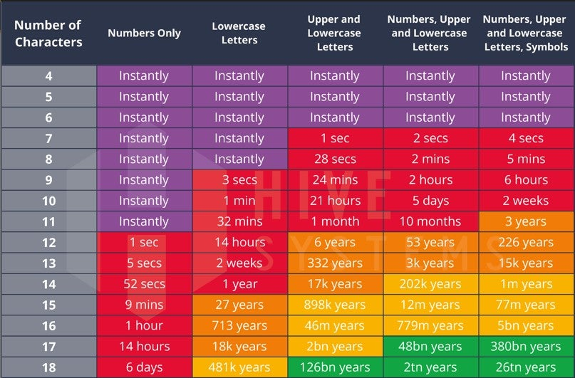

<h1 align="center">🔐 Password Checker & Generator</h1>

A simple tool to check password strength and generate secure passwords.

## ✨ Features

### Password Strength Checker
- Evaluates passwords on a **1-10 scale**
- Analyzes multiple security factors:
  - ✅ Uppercase letters
  - ✅ Lowercase letters
  - ✅ Numbers
  - ✅ Special symbols
  - ✅ Password length

### Password Generator
- Creates **strong random passwords**
- Customizable length (minimum 8 characters)
- Guarantees inclusion of:
  - At least 1 uppercase letter
  - At least 1 lowercase letter
  - At least 1 number
  - At least 1 special symbol

## 🚀 How It Works

### Check Password Strength
1. Enter your password
2. Get instant feedback with a score from 1-10
3. See detailed breakdown of character types used

### Generate Strong Password
1. Specify desired length (8+ characters)
2. Receive a cryptographically strong password
3. Copy and use immediately

## 🛡️ Security Rules

- Minimum password length: **8 characters**
- Generated passwords include all character types
- Random distribution ensures unpredictability

## THIS IS HOW MUCH TIME YOUR PASSWROD CAN BE CREACKED. SO CHOOSE YOUR PASSWORD WISELY.

## 

### to run this project download jar file in the relaese and and open the terminal in the same directory the jar file exists and type 

  java -jar Password-Checker-and-Generator.jar

